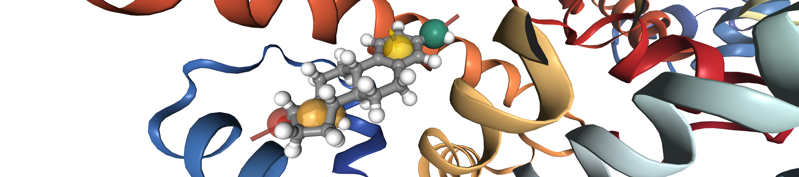

# OpenPharmacophore


OpenPharmacophore is a library designed to work with pharmacophore models and perform virtual screening. It 
can derive pharmacophores from ligand-based as well as structured-based methods. It also offers
the possibility to derive pharmacophores from molecular dynamics trajectories.



## Installation


The latest "stable" version of OpenPharmacophore can be installed from the UIBCDF Anaconda channel:

```bash
conda -c uibcdf openpharmacophore
```

## Examples

### Ligand based pharmacophores
  - [Preparing ligand for pharmacophore extraction](contents/examples/ligand-based/ligand_preparation.ipynb)

### Ligand-receptor based pharmacophores
  - [Protein-ligand complex of estrogen receptor with estradiol](contents/examples/ligand-receptor/er-alpha.ipynb)

### Dynamic pharmacophores
  - [Obtaining a ligand-receptor pharmacophore model from a MD trajectory](contents/examples/dynamic-pharmacophore/er_alpha_md.ipynb)

### Virtual Screening

- [Virtual screening with pharmacohore model](contents/examples/virtual-screening/screening.ipynb)

### Receptor based pharmacophores

- Coming soon...


### Others

#### Protein-ligand interactions

- [Aromatic Interactions](contents/examples/other/pl-interactions/aromatic_interactions.ipynb)
- [Hydrogen Bonding](contents/examples/other/pl-interactions/hydrogen_bonding.ipynb)
- [Hydrophobic Interactions](contents/examples/other/pl-interactions/hydrophobic_interactions.ipynb)


#### Binding site

- [Protein-ligand complex binding site](contents/examples/other/binding-site/complex_binding_site.ipynb)


```{eval-rst}
.. toctree::
   :name: examples
   :caption: Examples
   :maxdepth: 2
   :hidden:

   contents/index.md

.. toctree::
   :name: api_doc
   :caption: API Documentation
   :maxdepth: 2
   :hidden:

   api.rst
```
   